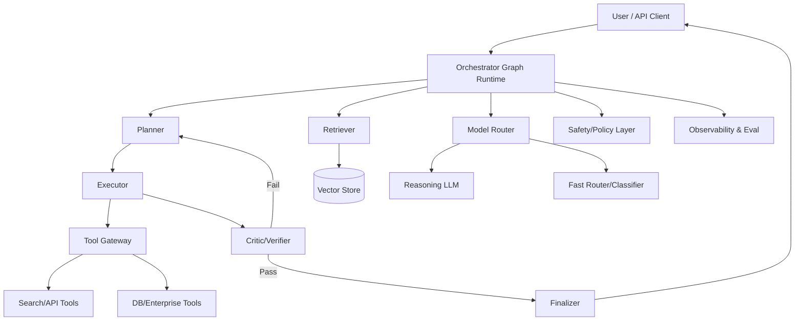
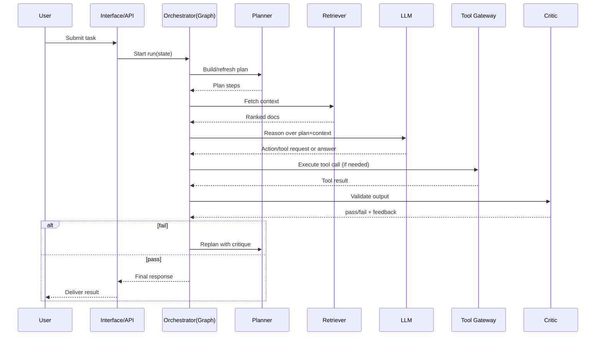
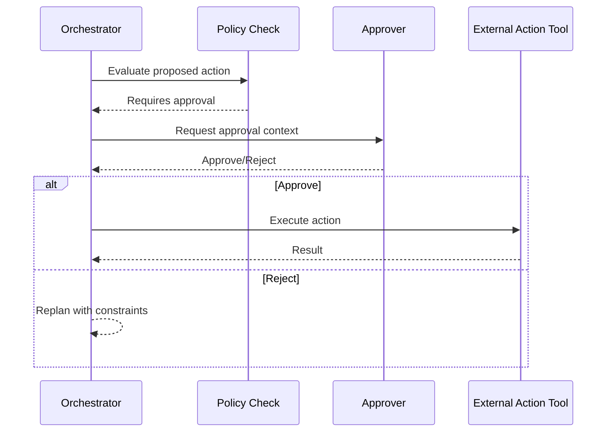
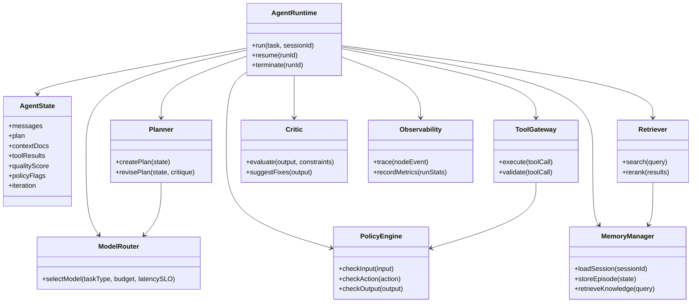

# Building AI Agents: Components, Architectures, and Design Blueprints

## 1) AI Agent System: Core Components

An AI agent is more than a single LLM call. It is an orchestration system with reasoning, memory, tool-use, control flow, and governance.

### 1.1 User Interface Layer
**Purpose**
- Accepts tasks, constraints, and feedback.
- Returns intermediate progress and final outputs.

**Typical subcomponents**
- Chat/API endpoint
- Session manager
- Streaming response handler

**LangGraph analogy**
- Entry point into a `StateGraph` run (`graph.invoke`, `graph.stream`)
- Session context persisted in graph state (thread/session IDs)

---

### 1.2 Orchestrator / Runtime Controller
**Purpose**
- Governs execution across planning, tool calling, reflection, and termination.
- Applies routing logic, retries, and policies.

**Typical subcomponents**
- State machine
- Step scheduler
- Retry/fallback policy

**LangGraph analogy**
- `StateGraph` nodes and edges
- Conditional edges (`add_conditional_edges`) for dynamic routing
- Looping between nodes until a stop condition is satisfied

---

### 1.3 Reasoning & Planning Engine
**Purpose**
- Breaks high-level goals into executable subtasks.
- Chooses strategy: direct answer vs. retrieval vs. tool-use vs. multi-step workflow.

**Planning styles**
- ReAct (reason+act interleaving)
- Plan-and-execute
- Tree/graph of thought variants

**LangGraph analogy**
- Dedicated `planner` node producing `plan` state
- Downstream execution nodes consume plan items
- Optional `replanner` node for adaptive plan correction

---

### 1.4 Model Layer (LLM + Specialized Models)
**Purpose**
- Performs language reasoning, extraction, synthesis, ranking, classification.
- Multi-model routing for cost/latency/quality tradeoffs.

**Model categories**
- General-purpose reasoning LLM
- Lightweight model for classification/routing
- Embedding model for retrieval
- Domain models (vision/audio/code)

**LangGraph analogy**
- Model invocation inside nodes
- Router node selects model profile and writes `model_choice` to state
- Different nodes mapped to different model providers/configs

---

### 1.5 Tooling Layer
**Purpose**
- Extends agent capabilities with deterministic operations and external systems.

**Common tools**
- Web/search
- Database query
- Code execution
- Calendar/email/CRM actions
- Internal APIs

**LangGraph analogy**
- Tool node(s) that consume structured tool calls from model output
- Tool result merged back into state
- Guardrail node validates tool requests before execution

---

### 1.6 Memory Layer
**Purpose**
- Preserves context across steps and sessions.

**Memory types**
- Working memory: current graph state
- Episodic memory: previous task traces
- Semantic memory: vectorized facts/knowledge
- Procedural memory: policies, skills, reusable playbooks

**LangGraph analogy**
- Graph state schema for short-term memory
- Checkpointing/persistence for resumable workflows
- Retrieval node pulls long-term memory and appends to context

---

### 1.7 Knowledge & Retrieval Layer (RAG)
**Purpose**
- Grounds model output in trusted data.

**Pipeline**
- Ingestion → chunking → embeddings → indexing
- Query rewrite → retrieval → reranking → synthesis

**LangGraph analogy**
- `retrieve` node + optional `rerank` node
- Retrieved docs injected into `context_docs` in state
- Conditional routing: if confidence low, re-query/expand search

---

### 1.8 Reflection, Verification, and Self-Correction
**Purpose**
- Improve reliability by critique and repair loops.

**Patterns**
- LLM-as-judge
- Rule-based validators
- Consistency checks across tools

**LangGraph analogy**
- `critic` node scores output quality
- Conditional edge to `revise` node when below threshold
- Loop until pass or max iterations

---

### 1.9 Safety, Governance, and Policy Controls
**Purpose**
- Enforces compliance, privacy, and action safety.

**Controls**
- Input/output moderation
- PII redaction
- Tool permission scopes
- Human approval gates for high-risk actions

**LangGraph analogy**
- `policy_check` node before tool/action nodes
- Human-in-the-loop interrupt node for approval
- Audit metadata appended to state at every critical step

---

### 1.10 Observability and Evaluation
**Purpose**
- Measures quality, latency, cost, and failure modes.

**Signals**
- Token usage
- Node-level latency
- Tool success rate
- Hallucination proxy metrics
- Task completion score

**LangGraph analogy**
- Node-level tracing hooks and run metadata
- Evaluation graph run on recorded trajectories
- Regression suite over benchmark tasks

---

## 2) Reference Architecture (Logical View)



---

## 3) Sequence Diagrams

## 3.1 Standard Agent Run (Plan → Act → Verify)



## 3.2 Human-in-the-Loop for High-Risk Actions



---

## 4) Class Diagram (Conceptual)



---

## 5) Model Strategy: Choosing and Combining Models

### 5.1 Single-model baseline
- One capable model handles planning + tool decisions + synthesis.
- Fast to ship; less predictable at scale.

### 5.2 Multi-model routing
- Small model for intent/routing.
- Strong model for complex reasoning.
- Specialized models for domain tasks.

### 5.3 Cost-latency-quality policy
- Route by task complexity score.
- Escalate model tier only when confidence is low.
- Cache deterministic sub-results.

**LangGraph analogy**
- Routing node computes `complexity_score` and sets `model_tier`.
- Conditional edge dispatches to node variants (`solve_fast`, `solve_deep`).

---

## 6) Execution Patterns for AI Agents

### 6.1 ReAct loop
- Think → act (tool) → observe → think.
- Strong for exploratory tasks.

**LangGraph analogy**
- Cycle between `reason` and `tool` nodes with stop condition edge.

### 6.2 Plan-and-execute
- Precompute plan, then run steps.
- Better control and observability.

**LangGraph analogy**
- `planner` node populates step queue; `executor` pops tasks until empty.

### 6.3 Critique-and-revise
- Draft output, critique, revise.
- Improved quality for writing and analysis.

**LangGraph analogy**
- `draft -> critic -> revise` loop using quality threshold in state.

---

## 7) Reliability Blueprint

### 7.1 Failure categories
- Retrieval miss
- Tool schema mismatch
- Model overconfidence/hallucination
- Policy conflict
- Context overflow

### 7.2 Mitigations
- Structured outputs with strict schemas
- Tool argument validation
- Dual-source verification for factual claims
- Retry with transformed queries
- Context compaction and memory summaries

**LangGraph analogy**
- Validation nodes after each critical node.
- Error edges to specialized recovery nodes.

---

## 8) Production Readiness Checklist

- Defined state schema and versioning
- Deterministic tool interfaces with tests
- End-to-end traces and replayable runs
- Evaluation dataset with pass/fail rubrics
- Human override and rollback paths
- Security controls for secrets and PII
- Cost guardrails and budgets

**LangGraph analogy**
- State type definitions + checkpointing.
- Graph test harness with fixed seeds and golden trajectories.

---

## 9) Minimal End-to-End Build Order

1. Define task scope and success metrics.
2. Implement base graph with 4 nodes: `planner`, `retrieve`, `execute`, `finalize`.
3. Add tool gateway + schema validation.
4. Add memory and retrieval.
5. Add critic loop for self-correction.
6. Add policy/human approval for risky actions.
7. Add traces + evaluation suite.
8. Add model routing and optimization.

---

## 10) Component-to-LangGraph Mapping (Quick Table)

| Agent Component | Responsibility | LangGraph Analogy |
|---|---|---|
| Interface Layer | Input/output handling | `graph.invoke`, `graph.stream`, session state |
| Orchestrator | Control flow | `StateGraph` nodes + edges |
| Planner | Task decomposition | `planner` node writing plan to state |
| Model Layer | Reasoning/completion | Model calls inside nodes |
| Tooling | External actions | Tool node + result merge |
| Memory | Short/long-term context | State + persistence + retrieval nodes |
| RAG | Knowledge grounding | `retrieve`/`rerank` nodes |
| Critic | Quality verification | `critic` node + revise loop |
| Policy/Safety | Guardrails | `policy_check` node + approval edge |
| Observability | Metrics/traces | Run traces, node telemetry, eval workflows |

---

## 11) Suggested State Schema (Conceptual)

```yaml
session_id: string
task:
  goal: string
  constraints: list
plan:
  steps: list
  current_step: int
context_docs: list
tool_calls: list
tool_results: list
model_choice:
  tier: string
  reason: string
quality:
  score: float
  threshold: float
policy:
  flags: list
  requires_human_approval: bool
output:
  draft: string
  final: string
runtime:
  iteration: int
  max_iterations: int
  status: string
```

This schema is a practical backbone for implementing robust AI agents with explicit control flow, observability, and safe tool use.
