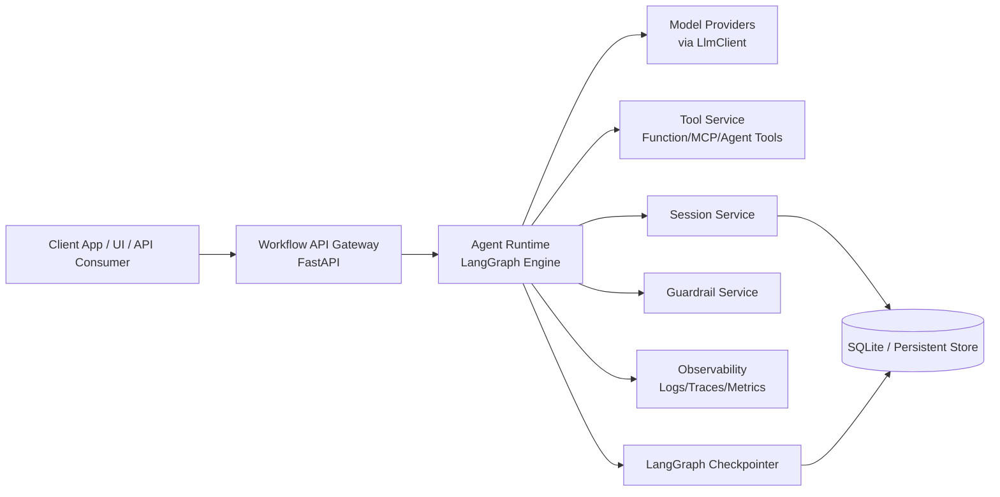
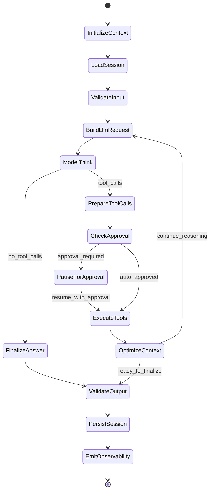
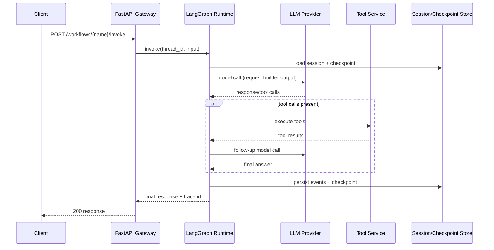
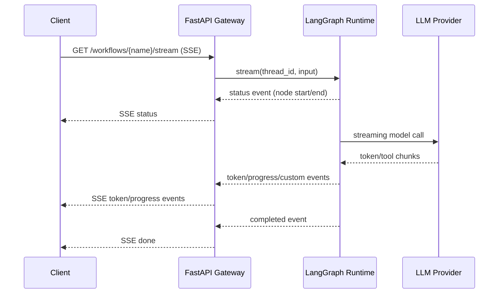
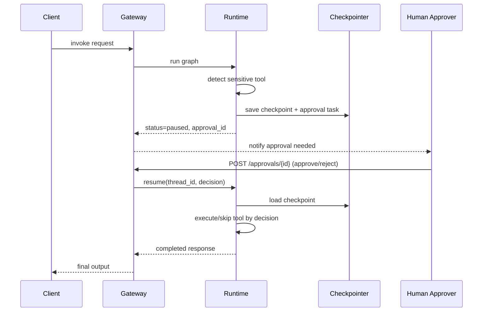

# High-Level Design (HLD): Book-Grounded LangGraph Agent Framework

## 1. Goals, Non-Goals, and V1 Boundaries

### 1.1 System Goals

The framework provides a production-oriented, book-grounded agent platform that:

- Implements a ReAct-style agent loop on LangGraph with durable execution.
- Preserves complete conversation/tool history while optimizing model-facing context.
- Exposes sync, async, and streaming workflow APIs.
- Supports tool execution with optional human approval for sensitive actions.
- Adds first-class guardrails, observability, and extension points for evaluation and multi-agent orchestration.

### 1.2 Non-Goals (V1)

- Full enterprise RAG ingestion/indexing pipelines.
- Network-level A2A protocol standardization across remote runtimes.
- Fully isolated arbitrary code execution sandbox in core runtime.
- Complete LLM-as-judge evaluation service.

### 1.3 V1 Scope Boundary

Included in V1:

- LangGraph-based single-agent runtime.
- Book-aligned ReAct loop and context optimization.
- Session memory and checkpoint-backed pause/resume.
- Function tools with registry, metadata, and approval requirements.
- Input/output guardrail hooks.
- FastAPI gateway for sync, async, and SSE streaming.
- SQLite-backed persistence for sessions/events/jobs/traces/tool calls.
- Structured logs, traces, and metrics.
- Docker Compose local deployment topology.

Deferred beyond V1:

- Dedicated data indexing service and advanced retrieval orchestration.
- Distributed multi-runtime A2A networking.
- Hardened workspace execution service in core product (kept as extension point).

---

## 2. Book Component Model and Framework Mapping

### 2.1 `ExecutionContext`

Book concept maps to:

- **LangGraph state**: mutable execution state used by graph nodes.
- **Immutable event log**: append-only records of user/model/tool/guardrail events.
- **Thread identity (`thread_id`)**: durable session/execution key.

This dual model preserves correctness (full fidelity storage) and flexibility (prompt-level selection).

### 2.2 Tools: `BaseTool`, `FunctionTool`, MCP Tool, `AgentTool`

- `BaseTool`: common interface (`name`, `schema`, `execute`, idempotency behavior, approval metadata).
- `FunctionTool`: wraps Python callables as tools.
- MCP Tool adapter: integrates external MCP-provided capabilities using shared tool contract.
- `AgentTool`: exposes another agent/workflow as a callable tool, enabling hierarchical composition.

### 2.3 Model Layer: `LlmRequest`, `LlmResponse`, `LlmClient`

- `LlmRequest`: normalized prompt payload, tool schemas, response controls.
- `LlmResponse`: normalized message, tool calls, token usage, raw provider metadata.
- `LlmClient`: pluggable provider abstraction to decouple runtime from vendor SDK details.

### 2.4 ReAct Loop in LangGraph

The book loop is implemented as a state graph with deterministic node boundaries:

1. Initialize context
2. Load session/memory
3. Validate input (guardrails)
4. Build model request
5. Think/model call
6. Route decision: final answer vs tool calls
7. Optional human approval
8. Execute tools
9. Optimize context
10. Validate output (guardrails)
11. Persist session + checkpoint
12. Emit observability

### 2.5 Context Optimization

Storage/presentation split:

- Session store retains full raw events.
- Request builder applies strategy:
  - sliding window of recent turns,
  - selective system/tool summaries,
  - compaction/summarization abstraction.

### 2.6 Session and Memory

- Thread-centric session with durable checkpoints.
- Message and event history persisted in database.
- Short-term working state in graph; long-term memory as persisted event stream.

### 2.7 Human-in-the-Loop

- Sensitive tools flagged `approval_required=true`.
- Graph pauses before execution.
- External API receives approval task and resumes using checkpoint + decision payload.

### 2.8 Planning and Reflection

- Implemented as internal tools or graph subroutines.
- Plan artifacts and reflections are captured as events and optionally hidden from user-facing output.

### 2.9 Workspace/Code Execution (Secured Extension)

- Core design defines extension interface for isolated execution service.
- V1 documents contract but avoids embedding unrestricted execution.

### 2.10 Multi-Agent Patterns

- **Agent-as-tool**: parent agent invokes specialist child.
- **Transfer/handoff**: ownership of task state transitions to target agent.
- **Workflow orchestration**: graph-level coordination among role-specific agents.

### 2.11 Observability and Evaluation Extension Points

- Trace spans at node/tool/model boundaries.
- Metrics for latency, tool frequency, guardrail outcomes, token usage.
- Evaluation hooks for offline replay and quality scoring.

---

## 3. Platform Mapping from Earlier Chapters

### 3.1 SDK / Runtime

- Developer-facing SDK defines Agent, Workflow, Tool, Guardrail contracts.
- Runtime executes workflows on LangGraph engine.

### 3.2 Workflow API Gateway

- FastAPI service for invoke, stream, job operations, health, metrics.

### 3.3 Model Abstraction

- Provider-agnostic `LlmClient` interface and adapters.

### 3.4 Session Service

- Session and history retrieval/persistence APIs.

### 3.5 Tool Service

- Tool registry, policy metadata, execution lifecycle, idempotency.

### 3.6 Guardrails

- Input gate before model call.
- Output gate before final response emission.

### 3.7 Observability

- Structured logs, trace events, metrics export.

---

## 4. Architecture Diagrams

### 4.1 Platform Context Diagram



### 4.2 Component Architecture Diagram

```mermaid
flowchart TB
    subgraph SDK[Developer SDK]
      AG[Agent]
      WF[@workflow]
      BT[BaseTool]
      FT[FunctionTool]
      AT[AgentTool]
      LC[LlmClient]
      GP[GuardrailPolicy]
    end

    subgraph Runtime[Runtime Core]
      ORCH[Workflow Orchestrator]
      GRAPH[LangGraph StateGraph]
      RQB[LlmRequestBuilder]
      ROUTE[ReAct Router]
      EXEC[Tool Executor]
      APPROVAL[Approval Manager]
      CTXOPT[Context Optimizer]
    end

    subgraph Platform[Platform Services]
      API[FastAPI Gateway]
      SVCSESS[Session Manager]
      TOOLREG[Tool Registry]
      TRACE[Trace/Metrics Emitter]
      STORE[(SQLite + Checkpoints)]
    end

    SDK --> API
    API --> ORCH
    ORCH --> GRAPH
    GRAPH --> RQB
    GRAPH --> ROUTE
    GRAPH --> EXEC
    GRAPH --> APPROVAL
    GRAPH --> CTXOPT
    GRAPH --> SVCSESS
    GRAPH --> TRACE
    SVCSESS --> STORE
    ORCH --> TOOLREG
```

### 4.3 LangGraph ReAct State Graph



### 4.4 Sync Request Sequence



### 4.5 Streaming Request Sequence



### 4.6 Human Approval Pause/Resume Flow



### 4.7 Docker Compose Deployment Shape

```mermaid
flowchart TB
    subgraph DockerHost[Local Docker Compose]
      API[agent-api\nFastAPI + runtime]
      DB[(sqlite volume)]
      OTEL[otel-collector (optional)]
      DASH[observability UI (optional)]
    end

    User[Developer / Local Client] --> API
    API --> DB
    API --> OTEL
    OTEL --> DASH
    API --> LLM[External LLM API]
```

---

## 5. Key Architectural Decisions

1. **LangGraph-first runtime** for deterministic control flow plus durable checkpointing.
2. **Thread-centric identity** (`thread_id`) unifies API, memory, and resume semantics.
3. **Immutable event log + mutable graph state** to balance auditability and execution convenience.
4. **Tool safety via approval gates** with explicit pause/resume.
5. **Context optimization outside storage** to prevent irreversible memory loss.
6. **Provider abstraction** to avoid lock-in and simplify testing.
7. **Observability by default** with structured trace events for every node transition.

---

## 6. Risks and Mitigations

- **Runaway loops / excessive tool calls**  
  Mitigation: max-iteration limits, timeout budgets, tool-call quotas.

- **Prompt bloat / context drift**  
  Mitigation: sliding window + compaction + summarization hooks.

- **Unsafe tool execution**  
  Mitigation: approval-required metadata, allowlists, idempotency keys.

- **Inconsistent resumes**  
  Mitigation: checkpoint integrity checks and deterministic resume inputs.

- **Observability blind spots**  
  Mitigation: mandatory trace emission contracts per node/tool/model call.

---

## 7. HLD Exit Criteria

HLD is complete when:

- Book component model is fully mapped to framework architecture.
- Platform service boundaries are defined.
- Required Mermaid diagrams are present and internally consistent.
- V1 scope and deferred capabilities are explicit.

