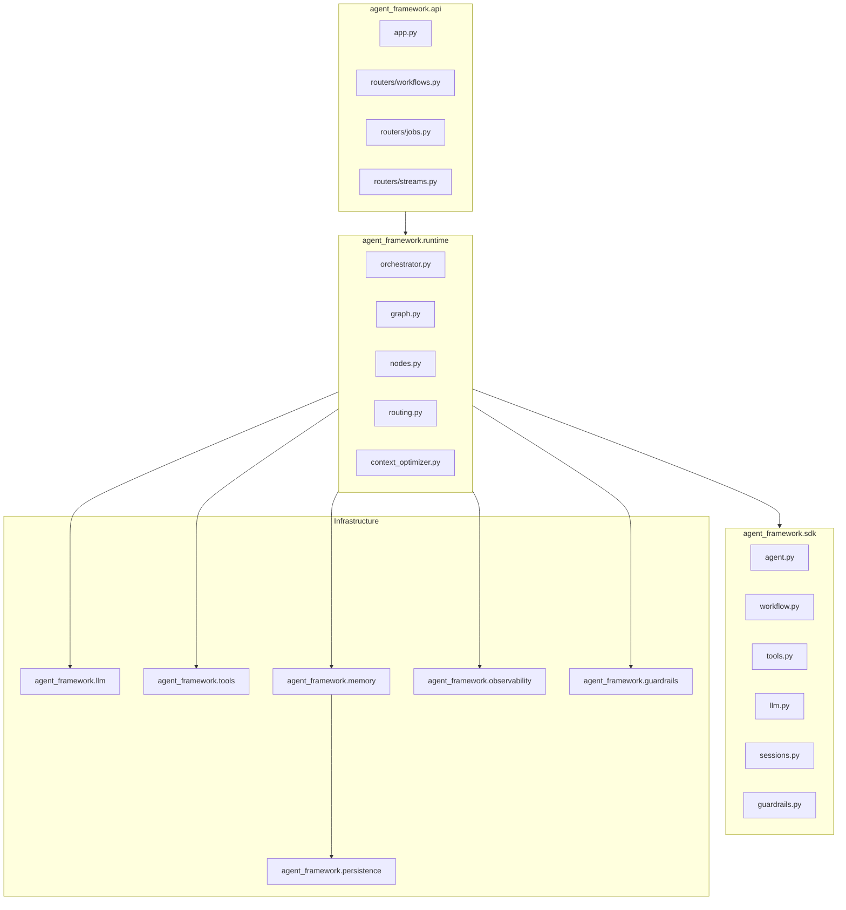
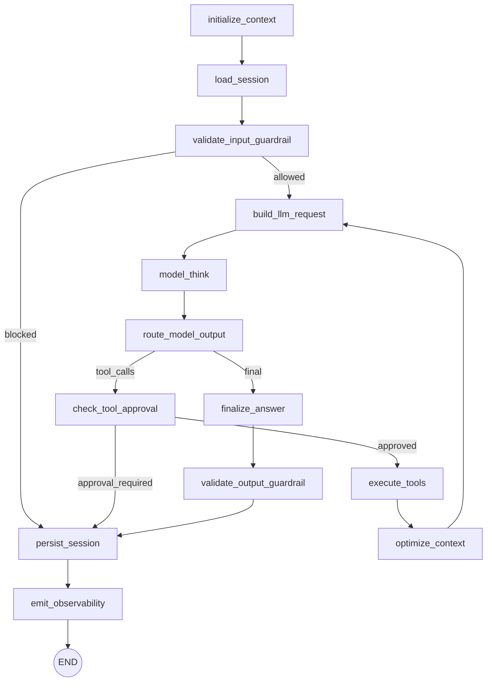
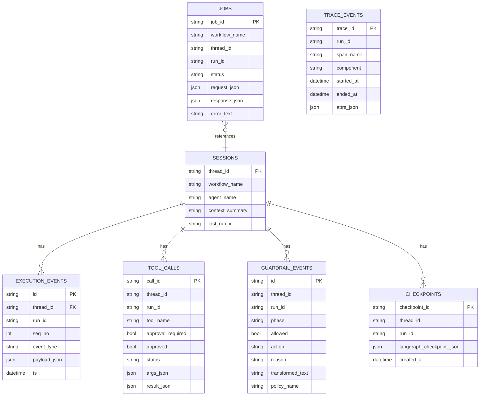
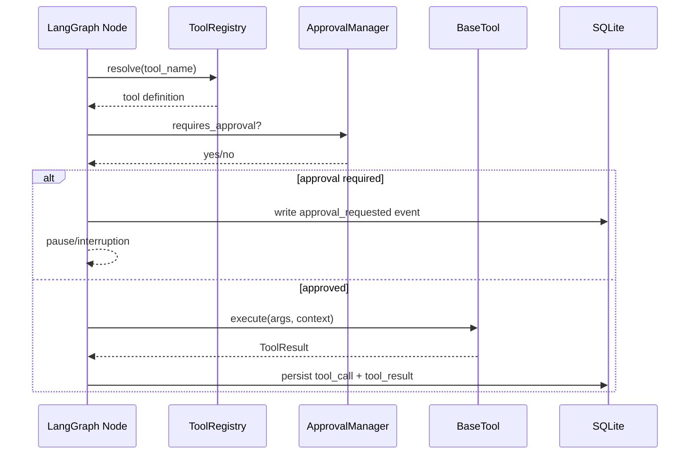
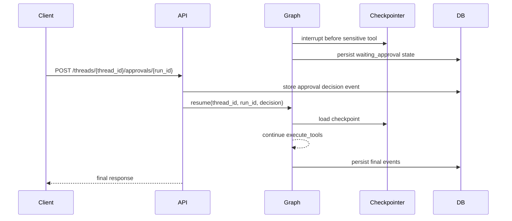
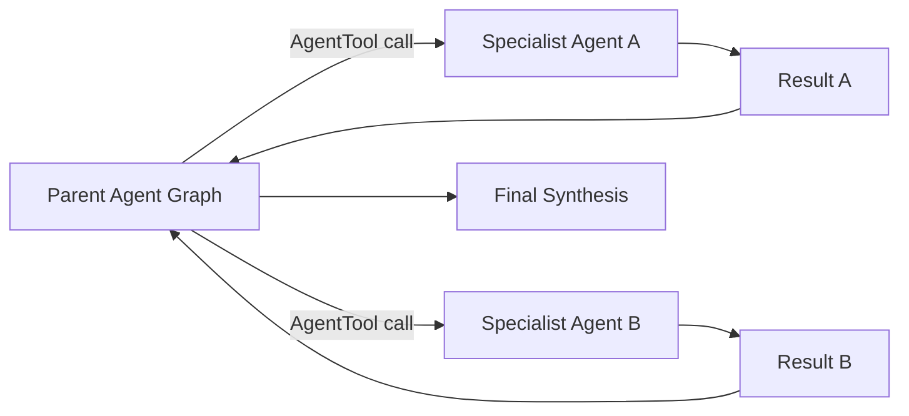

# Low-Level Design (LLD): Book-Grounded LangGraph Agent Framework

## 1. Scope and Design Constraints

This LLD translates `BOOK_GROUNDED_LANGGRAPH_AGENT_FRAMEWORK_PLAN.md` and `docs/hld.md` into implementation-ready details for V1.

### 1.1 In Scope (V1)

- Python package implementation under `agent_framework/`.
- LangGraph state machine implementing the ReAct loop.
- FastAPI APIs for sync invoke, async jobs, and SSE streaming.
- SQLite persistence for sessions, events, checkpoints, jobs, traces, tool calls, and guardrail outcomes.
- Human approval pause/resume for sensitive tools.
- Guardrails (pre-input and post-output).
- Observability (structured logs/traces/metrics).

### 1.2 Out of Scope (V1)

- Full RAG indexing pipelines.
- Remote A2A protocol.
- Built-in unrestricted code execution sandbox.
- Full evaluation platform (only extension hooks defined).

### 1.3 Core Technical Choices

- **Language/runtime**: Python 3.11+.
- **Workflow engine**: LangGraph `StateGraph` with checkpointing.
- **Web layer**: FastAPI + Uvicorn.
- **Persistence**: SQLite (sync/async access with SQLAlchemy).
- **Serialization**: Pydantic models for API contracts and state payloads.
- **Streaming**: SSE endpoint emitting graph progress and model token/custom events.

---

## 2. Package Structure (`agent_framework/`)

```text
agent_framework/
  __init__.py
  config.py
  platform.py
  api/
    __init__.py
    app.py
    deps.py
    routers/
      workflows.py
      jobs.py
      streams.py
      health.py
      metrics.py
    schemas/
      common.py
      workflows.py
      jobs.py
      streams.py
  runtime/
    __init__.py
    orchestrator.py
    graph.py
    nodes.py
    routing.py
    context_optimizer.py
    approvals.py
    workflow_registry.py
  sdk/
    __init__.py
    agent.py
    workflow.py
    tools.py
    llm.py
    sessions.py
    guardrails.py
  llm/
    __init__.py
    base.py
    types.py
    request_builder.py
    adapters/
      openai_adapter.py
      anthropic_adapter.py
  tools/
    __init__.py
    base.py
    function_tool.py
    agent_tool.py
    registry.py
    execution.py
  memory/
    __init__.py
    session_manager.py
    repositories.py
    models.py
  persistence/
    __init__.py
    db.py
    tables.py
    migrations/
  guardrails/
    __init__.py
    policies.py
    engine.py
  observability/
    __init__.py
    logging.py
    tracing.py
    metrics.py
  workers/
    __init__.py
    jobs.py
  examples/
    support_agent.py
    planner_agent.py
```

### 2.1 Module Responsibilities

- `platform.py`: concrete `AgentPlatform` composition root.
- `runtime/graph.py`: graph build function + checkpointer wiring.
- `runtime/nodes.py`: deterministic node handlers.
- `sdk/*`: public extension interfaces.
- `persistence/*`: ORM models + DB setup.
- `memory/session_manager.py`: session/history abstraction over repositories.
- `api/routers/*`: transport layer only (no orchestration logic).

---

## 3. SDK Interfaces

## 3.1 `AgentPlatform`

```python
class AgentPlatform(Protocol):
    def register_agent(self, agent: "Agent") -> None: ...
    def register_workflow(self, workflow_name: str, fn: Callable[..., Any]) -> None: ...
    async def invoke(self, request: "WorkflowInvokeRequest") -> "WorkflowInvokeResponse": ...
    async def invoke_async(self, request: "WorkflowInvokeRequest") -> "JobAcceptedResponse": ...
    async def stream(self, request: "WorkflowInvokeRequest") -> AsyncIterator["StreamEvent"]: ...
    async def resume_approval(self, thread_id: str, decision: "ApprovalDecision") -> "WorkflowInvokeResponse": ...
```

## 3.2 `Agent`

```python
class Agent(Protocol):
    name: str
    description: str
    system_prompt: str
    tools: list["BaseTool"]
    guardrail_policy: "GuardrailPolicy | None"

    def build_initial_state(self, input_text: str, **kwargs) -> dict: ...
```

## 3.3 `@workflow`

- Decorator that registers a callable workflow entrypoint.
- Metadata captured: `name`, `agent`, `input_schema`, `output_schema`, `timeout_s`, `idempotent`.
- Registry source of truth: `runtime/workflow_registry.py`.

## 3.4 Tools (`BaseTool`, `FunctionTool`, `AgentTool`)

```python
class BaseTool(ABC):
    name: str
    description: str
    input_schema: dict
    approval_required: bool = False
    idempotent: bool = True

    @abstractmethod
    async def execute(self, ctx: "ToolExecutionContext", args: dict) -> "ToolResult": ...

class FunctionTool(BaseTool):
    wrapped: Callable[..., Any]

class AgentTool(BaseTool):
    target_workflow: str
```

## 3.5 `LlmClient`

```python
class LlmClient(Protocol):
    async def complete(self, request: "LlmRequest") -> "LlmResponse": ...
    async def stream(self, request: "LlmRequest") -> AsyncIterator["LlmStreamChunk"]: ...
```

## 3.6 `SessionManager`

```python
class SessionManager(Protocol):
    async def load_session(self, thread_id: str) -> "SessionSnapshot": ...
    async def append_event(self, thread_id: str, event: "ExecutionEvent") -> None: ...
    async def save_checkpoint_ref(self, thread_id: str, checkpoint_id: str) -> None: ...
```

## 3.7 `GuardrailPolicy`

```python
class GuardrailPolicy(Protocol):
    async def validate_input(self, state: "AgentState") -> "GuardrailResult": ...
    async def validate_output(self, state: "AgentState") -> "GuardrailResult": ...
```

---

## 4. LangGraph State Schemas

All schemas are Pydantic models (or `TypedDict` where LangGraph requires lightweight state).

### 4.1 `AgentState`

```python
class AgentState(TypedDict, total=False):
    run_id: str
    thread_id: str
    workflow_name: str
    agent_name: str
    input_text: str
    messages: list[dict]               # model-facing rolling context
    event_ids: list[str]               # persisted event references
    pending_tool_calls: list["ToolCall"]
    tool_results: list["ToolResult"]
    guardrail_results: list["GuardrailResult"]
    final_output: str | None
    status: Literal[
        "running", "waiting_approval", "completed", "failed", "blocked"
    ]
    next_action: Literal[
        "model", "tools", "finalize", "pause_approval", "error"
    ]
    error: str | None
    context_summary: str | None
    trace_buffer: list["TraceEvent"]
```

### 4.2 `ExecutionEvent`

```python
class ExecutionEvent(BaseModel):
    id: str
    thread_id: str
    run_id: str
    seq_no: int
    ts: datetime
    event_type: Literal[
        "user_message", "model_request", "model_response", "tool_call",
        "tool_result", "guardrail", "approval_requested", "approval_decision",
        "system", "final_output"
    ]
    payload: dict
```

### 4.3 `ToolCall`

```python
class ToolCall(BaseModel):
    call_id: str
    tool_name: str
    args: dict
    approval_required: bool
    idempotency_key: str
```

### 4.4 `ToolResult`

```python
class ToolResult(BaseModel):
    call_id: str
    tool_name: str
    ok: bool
    output: dict | str | None
    error: str | None
    started_at: datetime
    finished_at: datetime
```

### 4.5 `GuardrailResult`

```python
class GuardrailResult(BaseModel):
    phase: Literal["input", "output"]
    allowed: bool
    action: Literal["allow", "block", "sanitize"]
    reason: str | None
    transformed_text: str | None
    policy_name: str
```

### 4.6 `TraceEvent`

```python
class TraceEvent(BaseModel):
    trace_id: str
    run_id: str
    span_name: str
    component: Literal["node", "llm", "tool", "guardrail", "api"]
    started_at: datetime
    ended_at: datetime
    attrs: dict[str, Any]
```

### 4.7 `WorkflowJob`

```python
class WorkflowJob(BaseModel):
    job_id: str
    workflow_name: str
    thread_id: str
    run_id: str
    status: Literal["queued", "running", "waiting_approval", "completed", "failed"]
    request_payload: dict
    response_payload: dict | None
    error: str | None
    created_at: datetime
    updated_at: datetime
```

---

## 5. Graph Nodes and Conditional Edges

## 5.1 Nodes

1. `initialize_context`
   - seeds `run_id`, default state, trace span.
2. `load_session`
   - reads previous events/context summary and populates `messages`.
3. `validate_input_guardrail`
   - invokes `GuardrailPolicy.validate_input`.
   - on block => `status=blocked`, `next_action=error`.
4. `build_llm_request`
   - `LlmRequestBuilder` selects subset from history + summaries + tool schemas.
5. `model_think`
   - calls `LlmClient.complete` or streamed variant.
6. `route_model_output`
   - if tool calls exist => `next_action=tools`; else `next_action=finalize`.
7. `check_tool_approval`
   - if any pending call requires approval and no decision exists => pause.
8. `execute_tools`
   - executes allowed calls, records `ToolResult`.
9. `optimize_context`
   - applies sliding window + compaction/summarizer.
10. `finalize_answer`
    - converts model output to canonical final response payload.
11. `validate_output_guardrail`
    - applies output guardrail actions.
12. `persist_session`
    - appends events, stores checkpoint ref, upserts session.
13. `emit_observability`
    - flushes trace/metrics/log events.

## 5.2 Conditional Edge Rules

- `validate_input_guardrail`:
  - `allowed=True` -> `build_llm_request`
  - `allowed=False` -> `persist_session`
- `route_model_output`:
  - `next_action="tools"` -> `check_tool_approval`
  - `next_action="finalize"` -> `finalize_answer`
- `check_tool_approval`:
  - approval needed -> `persist_session` (graph interrupted)
  - otherwise -> `execute_tools`
- `execute_tools`:
  - success -> `optimize_context` -> loop `build_llm_request`
  - unrecoverable tool failure -> `finalize_answer` with error-safe response
- `validate_output_guardrail`:
  - `allow/sanitize` -> `persist_session`
  - `block` -> `persist_session` with blocked output template
- `persist_session` -> `emit_observability` -> `END`

---

## 6. API Contracts

Base path: `/v1`.

## 6.1 Sync Workflow Invocation

- **POST** `/v1/workflows/{workflow_name}/invoke`
- Request:

```json
{
  "thread_id": "optional-string",
  "input": "user text",
  "metadata": {"tenant_id": "t1"},
  "options": {"timeout_s": 60}
}
```

- Response 200:

```json
{
  "run_id": "uuid",
  "thread_id": "thread-123",
  "status": "completed",
  "output": "assistant response",
  "tool_calls": [],
  "guardrail": {"output_action": "allow"},
  "usage": {"input_tokens": 123, "output_tokens": 45}
}
```

## 6.2 Async Job Submission and Polling

- **POST** `/v1/workflows/{workflow_name}/jobs`
  - returns `202 Accepted` with `job_id`.
- **GET** `/v1/jobs/{job_id}`
  - returns job status + response/error when terminal.
- **POST** `/v1/jobs/{job_id}/cancel`
  - best-effort cancellation when job is queued/running.

## 6.3 SSE Streaming Invocation

- **POST** `/v1/workflows/{workflow_name}/stream`
- Response: `text/event-stream`
- Event types:
  - `run.started`
  - `node.started`
  - `node.finished`
  - `llm.token`
  - `tool.call`
  - `tool.result`
  - `approval.required`
  - `run.completed`
  - `run.failed`

SSE payload contract:

```json
{
  "event": "llm.token",
  "run_id": "uuid",
  "thread_id": "thread-123",
  "seq": 42,
  "ts": "2026-01-01T00:00:00Z",
  "data": {"text": "partial-token"}
}
```

## 6.4 Approval/Resume

- **POST** `/v1/threads/{thread_id}/approvals/{run_id}`

```json
{
  "decisions": [
    {"call_id": "toolcall-1", "approved": true, "reason": "user confirmed"}
  ]
}
```

- Response 200: resumed run final/ongoing status.

## 6.5 Health and Metrics

- **GET** `/health/live` => process up.
- **GET** `/health/ready` => DB + checkpointer + registry readiness.
- **GET** `/metrics` => Prometheus text format.

---

## 7. SQLite Persistence Design

Database file: configurable (`AGENT_FRAMEWORK_DB_URL`, default `sqlite+aiosqlite:///./agent_framework.db`).

## 7.1 Tables

1. `sessions`
   - `thread_id` (PK)
   - `workflow_name`, `agent_name`
   - `context_summary`
   - `last_run_id`
   - timestamps

2. `execution_events`
   - `id` (PK)
   - `thread_id` (FK -> sessions.thread_id)
   - `run_id`, `seq_no`, `ts`, `event_type`
   - `payload_json`
   - unique `(run_id, seq_no)`

3. `checkpoints`
   - `checkpoint_id` (PK)
   - `thread_id`
   - `run_id`
   - `langgraph_checkpoint_json`
   - `created_at`

4. `jobs`
   - `job_id` (PK)
   - `workflow_name`, `thread_id`, `run_id`
   - `status`, `request_json`, `response_json`, `error_text`
   - timestamps

5. `trace_events`
   - `trace_id` (PK)
   - `run_id`, `span_name`, `component`
   - `started_at`, `ended_at`
   - `attrs_json`

6. `tool_calls`
   - `call_id` (PK)
   - `run_id`, `thread_id`, `tool_name`
   - `args_json`, `approval_required`, `approved`
   - `status`, `result_json`, `error_text`
   - timestamps

7. `guardrail_events`
   - `id` (PK)
   - `run_id`, `thread_id`, `phase`
   - `allowed`, `action`, `reason`
   - `transformed_text`
   - `policy_name`, `created_at`

## 7.2 Indexes

- `idx_events_thread_ts(thread_id, ts)`
- `idx_events_run_seq(run_id, seq_no)`
- `idx_jobs_status(status)`
- `idx_tool_calls_run(run_id)`
- `idx_traces_run(run_id)`
- `idx_guardrails_run_phase(run_id, phase)`

## 7.3 Transaction Boundaries

- Each node side effect is committed atomically.
- `persist_session` wraps:
  - session upsert,
  - batch execution events insert,
  - checkpoint reference update.
- Idempotency key on tool calls avoids duplicate execution after resume/retry.

---

## 8. Mermaid Diagrams

## 8.1 Package/Module Diagram



## 8.2 Detailed Graph Node Diagram



## 8.3 Persistence ER Diagram



## 8.4 Tool Execution Sequence



## 8.5 Approval/Resume Sequence



## 8.6 Multi-Agent Orchestration Diagram



---

## 9. Execution Semantics and Error Handling

- **Idempotency**: every tool call gets deterministic `idempotency_key = hash(run_id + call_id + tool_name + args)`.
- **Retry policy**:
  - model call: configurable exponential backoff (max attempts default 2).
  - tool call: retry only for transient failures if `tool.idempotent=True`.
- **Failure mapping**:
  - input guardrail block -> HTTP 422 for sync API, `failed/blocked` for async.
  - unhandled runtime exceptions -> HTTP 500 + sanitized error payload.
- **Pause state**:
  - run status set `waiting_approval`.
  - no further node execution until explicit resume.

---

## 10. Config and Environment Variables

- `AGENT_FRAMEWORK_DB_URL` (default sqlite URL)
- `AGENT_FRAMEWORK_LOG_LEVEL` (default `INFO`)
- `AGENT_FRAMEWORK_METRICS_ENABLED` (`true/false`)
- `AGENT_FRAMEWORK_DEFAULT_MODEL`
- `AGENT_FRAMEWORK_MAX_CONTEXT_TOKENS`
- `AGENT_FRAMEWORK_SUMMARIZER_ENABLED`
- `AGENT_FRAMEWORK_JOB_WORKERS` (default `1`)
- Provider-specific keys (e.g., `OPENAI_API_KEY`)

---

## 11. Implementation Milestones (from this LLD)

1. Scaffold package/modules and base interfaces.
2. Implement persistence models/migrations and session repositories.
3. Implement LangGraph nodes + routing + checkpointer integration.
4. Implement tool registry/execution/approval manager.
5. Implement LLM adapters + request builder.
6. Implement FastAPI endpoints (sync/async/SSE/approval/health/metrics).
7. Add observability instrumentation.
8. Add example agents and smoke tests.

This LLD is implementation-complete for V1 and is ready to drive coding tasks.
